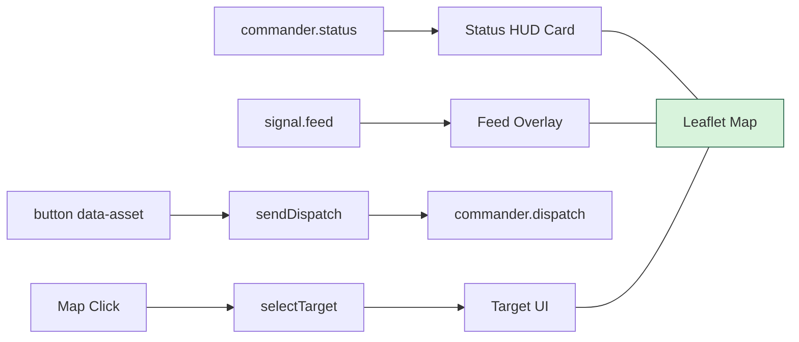

<!-- markdownlint-disable-file -->
# Task Research: Commander UX Map-Centered Redesign

Research for redesigning the commander UX so gameplay decisions happen without page scrolling, with the map as the focal surface, feed as map overlay, bottom/corner actions, and a clearer status model.

## Task Implementation Requests

* Remove linear panel flow and avoid scroll-to-play interaction.
* Make the map the center of action and place controls in corners or bottom HUD areas.
* Convert signal feed into an overlay instead of dedicated pane.
* Remove timeline from user-facing layout.
* Clarify command status semantics, including why barriers is counted and other mitigations are not.

## Scope and Success Criteria

* Scope: Commander web client layout and UI wiring in public/commander plus test coupling updates where layout IDs are asserted. No protocol/schema changes unless required.
* Assumptions:
  * Existing message contracts remain valid for redesigned UX.
  * Timeline is not required for players during active match operations.
  * Existing map interactions (click-to-target) must continue to work.
* Success Criteria:
  * No-scroll primary gameplay viewport at common desktop sizes.
  * Map remains the dominant visual element with overlay HUD controls.
  * Feed remains visible as contextual overlay with event severity cues.
  * Timeline removed from player-facing layout without breaking dispatch/status behavior.
  * Status panel semantics are internally consistent and actionable.

## Outline

1. Current-state evidence and causes of linear/scrolling behavior.
2. Contract-level constraints and what can change safely in UI only.
3. Alternative layouts and trade-offs.
4. Selected approach and implementation blueprint.
5. Risks, regressions, and validation checklist.

## Potential Next Research

* Mobile commander ergonomics for overlays (tabs vs drawers vs persistent cards)
  * Reasoning: Overlays can collide on narrow screens and need deterministic interaction patterns.
  * Reference: public/commander/styles.css:274-277
* Debug/operator timeline retention via feature flag
  * Reasoning: Timeline is useful for logging and QA but not needed in player UX.
  * Reference: public/commander/app.js:348-359, public/commander/index.html:87-100

## Research Executed

### File Analysis

* public/commander/index.html
  * Current UI uses sequential panel sections including status, map, dispatch, feed, timeline, dispatch results.
  * Timeline IDs are explicitly present in markup.
* public/commander/styles.css
  * Two-column grid with normal document flow plus fixed map wrapper height and nested list scrolling.
  * Mobile breakpoint collapses to one-column vertical stack.
* public/commander/app.js
  * Feed, timeline, status, and dispatch flows are independently wired and largely decoupled from layout.
  * appendSignal currently also appends timeline entries.
* src/messages/protocol.ts
  * CommanderStatus payload fields define available status semantics.
* src/game/MatchRoom.ts
  * activeBarriers metric is emitted as count from state.activeBarriers.length.
* src/game/GameLoop.ts
  * Barrier lifecycle create/expire confirms activeBarriers is true entity count.
* src/index.test.ts
  * HTML scaffold test currently asserts timeline IDs and will fail if timeline is removed.

### Code Search Results

* timelineFeed
  * public/commander/index.html:99
  * public/commander/app.js:21
  * src/index.test.ts:143
* commander.status
  * public/commander/app.js:593
  * src/game/MatchRoom.ts:799
* activeBarriers
  * public/commander/app.js:474
  * src/messages/protocol.ts:79
  * src/game/MatchRoom.ts:805
  * src/game/GameLoop.ts:191, src/game/GameLoop.ts:354

### External Research

* None required; this request is repository-implementation specific.

### Project Conventions

* Standards referenced: Existing commander client conventions and current message contracts.
* Instructions followed: Task Researcher mode constraints; research delegated to Researcher Subagent; primary document consolidated under .copilot-tracking/research/2026-06-24.

## Key Discoveries

### Project Structure

Commander UX is fully concentrated in:

* public/commander/index.html
* public/commander/styles.css
* public/commander/app.js

Server contracts already provide what the redesigned HUD needs, so UX changes can remain front-end focused.

### Implementation Patterns

* Feed flow: room.onMessage("signal.feed") -> appendSignal() -> list render with severity class and typewriter.
  * Evidence: public/commander/app.js:589-591, public/commander/app.js:437-455
* Timeline flow: independent render path with elapsed and derived ETA, plus append side-effects from feed/selection/match events.
  * Evidence: public/commander/app.js:348-402, public/commander/app.js:457, public/commander/app.js:529, public/commander/app.js:601, public/commander/app.js:698-700
* Dispatch flow: data-asset button click -> sendDispatch(asset) -> room.send("commander.dispatch", ...)
  * Evidence: public/commander/app.js:649-653, public/commander/app.js:612-634
* Status flow: commander.status payload updates scalar tactical fields.
  * Evidence: public/commander/app.js:470-488

### Complete Examples

```js
room.onMessage("commander.status", (payload) => {
  renderCommanderStatus(payload);
});

document.querySelectorAll("[data-asset]").forEach((button) => {
  button.addEventListener("click", () => {
    sendDispatch(button.dataset.asset);
  });
});
```

Source references:

* public/commander/app.js:593-595
* public/commander/app.js:649-653

### API and Schema Documentation

Commander status contract:

* src/messages/protocol.ts:74-85

Barrier count derivation:

* src/game/MatchRoom.ts:805

Barrier lifecycle semantics:

* src/game/GameLoop.ts:191-193
* src/game/GameLoop.ts:354-362

### Configuration Examples

```css
/* Current behavior that contributes to stacked scrolling */
.console-shell {
  display: grid;
  grid-template-columns: repeat(2, minmax(0, 1fr));
  gap: 16px;
}

.map-wrapper {
  height: 420px;
}

ul {
  max-height: 220px;
  overflow: auto;
}
```

Source references:

* public/commander/styles.css:31-37
* public/commander/styles.css:232-236
* public/commander/styles.css:181-187

## Technical Scenarios

### Scenario A: Absolute Overlay HUD (Selected)

A single viewport map stage with absolute-positioned HUD cards (top-left/session, top-right/status, bottom-right/dispatch, bottom-left/feed). Timeline removed from player-facing UI.

**Requirements:**

* No page scroll to play.
* Map-first visual hierarchy.
* Feed visible without dedicated full panel.
* Controls at corners/bottom for rapid actions.

**Preferred Approach:**

* Implement map-stage layout with overlays and bounded internal card scrolling.
* Keep current status/dispatch/feed message wiring with minimal JS surgery.

```text
public/commander/index.html
  - Replace sequential panel stack with map-stage + hud-card containers
  - Remove timeline section from player-facing DOM

public/commander/styles.css
  - Switch shell to full-viewport container (100dvh) and overflow hidden
  - Add absolute hud-card anchoring and responsive compact breakpoints

public/commander/app.js
  - Keep existing listeners and render functions
  - Remove timeline side-effect calls from appendSignal/selection paths
  - Optionally keep elapsed/ETA as compact metadata inside status card

src/index.test.ts
  - Replace timeline-id assertions with new HUD structure assertions
```



**Implementation Details:**

* Front-end-only layout transformation is feasible because message payloads already contain required fields.
* activeBarriers remains valid as a distinct tactical count because it maps to live barrier entities.
* To reduce semantic confusion, keep status card strictly tactical snapshot and leave asset inventory/cooldowns in dispatch card.

#### Considered Alternatives

Scenario B: Grid frame with fixed rails around map.

* Rejected because it satisfies no-scroll less reliably on narrow widths and is less aligned with requested overlay/action-game feel.
* Evidence: current grid-to-single-column collapse already demonstrates vertical stacking pressure (public/commander/styles.css:274-277).

### Scenario B: Keep Timeline but Collapse/Toggle It

Timeline remains in DOM behind a disclosure toggle/debug view.

**Requirements:**

* Preserve logs while reducing visible clutter.

**Preferred Approach:**

* Not selected as primary because request explicitly says timeline is not necessary for user and map space should increase.

#### Considered Alternatives

* Hidden-by-default timeline could still be useful for QA/operator workflows.
* If adopted later, keep behind explicit debug flag and prevent layout reserve in normal mode.

## Selected Approach and Rationale

Selected approach: Scenario A (Absolute Overlay HUD).

Rationale:

* Directly fulfills all user-stated UX goals (map centrality, corner/bottom actions, feed overlay, no timeline pane).
* Minimizes backend and protocol risk by preserving existing event contracts.
* Requires mostly HTML/CSS restructuring and small JS cleanup (remove timeline side effects).
* Keeps tactical decision data close to the map context, reducing navigation/scan overhead.

## Risks and Mitigations

* Test failures from removed timeline IDs
  * Mitigation: Update src/index.test.ts markup assertions to new HUD IDs/structure.
* Overlay collisions on small screens
  * Mitigation: Add compact breakpoint behavior and max-width constraints for cards.
* Readability over map imagery
  * Mitigation: Strong translucent panels with high-contrast text and subtle blur.
* Loss of timeline audit trail in player UI
  * Mitigation: Keep feed rich and consider debug-only timeline path later.

## Validation Checklist

* Desktop 1280x720 and 1920x1080: no page scroll required for primary play interactions.
* Mobile <= 880px: overlays remain operable with no long linear stack.
* Target select and map click targeting still dispatch correct selectedLeviathanId.
* Dispatch buttons continue cooldown/remaining updates from commander.status.
* Feed continues severity styling and dispatch-result insertion.
* activeBarriers increments on Raise Barrier and decays after barrier expiry.
* src/index.test.ts updated to match new player-facing structure.

## Actionable Next Steps for Implementation

1. Restructure public/commander/index.html into map-stage + four HUD cards.
2. Replace grid flow in public/commander/styles.css with viewport-locked map HUD system.
3. Remove timeline section from player-facing markup and timeline append side-effects in public/commander/app.js.
4. Normalize status card labels/semantics (BASE HP, SCORE, ACTIVE BARRIERS, CURRENT TARGET).
5. Update src/index.test.ts scaffold assertions to avoid timeline IDs and verify new HUD anchors.

## Evidence Log

* Subagent document: .copilot-tracking/research/subagents/2026-06-24/commander-ux-layout-research.md
* Core files and lines:
  * public/commander/index.html:13-106
  * public/commander/styles.css:31-37, 181-187, 207-212, 232-236, 274-277
  * public/commander/app.js:348-402, 437-455, 470-488, 589-595, 612-634, 649-686, 698-700
  * src/messages/protocol.ts:74-85
  * src/game/MatchRoom.ts:799-810
  * src/game/GameLoop.ts:191-193, 350-362
  * src/index.test.ts:141-143
