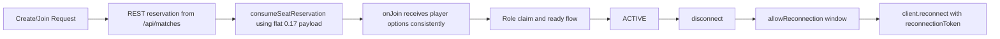

<!-- markdownlint-disable-file -->
# Task Research: Colyseus 0.17 Lobby And Room Join Bug

Investigate room join and matchmaking lobby failures in this repository, compare current implementation with native Colyseus 0.17 standard flows, determine root cause, and devise a practical fix.

## Task Implementation Requests

* Investigate the cause of bugs with joining rooms and using the matchmaking lobby.
* Ensure behavior aligns with native Colyseus 0.17 standard lobby and game room management flows.
* Devise a fix with implementation details and concrete file-level guidance.

## Scope and Success Criteria

* Scope: Client and server matchmaking and room-join flow in this repository, plus Colyseus 0.17 flow validation.
* Assumptions: The current branch contains the buggy implementation; Colyseus 0.17 APIs in dependencies are authoritative.
* Success Criteria:
  * Root cause(s) identified with evidence from repository files and line references.
  * Recommended fix follows Colyseus 0.17-native lobby and join semantics.
  * Actionable implementation plan provided with exact file targets.

## Outline

1. Gather repository flow evidence (client join, lobby updates, server matchmaking).
2. Gather Colyseus 0.17 canonical flow references.
3. Compare and identify mismatches.
4. Evaluate alternatives and choose the most robust fix.
5. Provide implementation-ready recommendation.

## Potential Next Research

* Validate native LobbyRoom adoption impact on existing mobile REST-only clients.
  * Reasoning: Ensure migration does not regress current low-capability clients.
  * Reference: src/index.ts:104-104, public/common/colyseus-client.js:280-286
* Capture runtime failure metrics for consumeSeatReservation fallback trigger rate.
  * Reasoning: Quantify seat-consume failures and prove fix effectiveness.
  * Reference: public/common/colyseus-client.js:151-168

## Research Executed

### File Analysis

* public/common/colyseus-client.js
  * Seat reservation conversion currently wraps reservation into nested room object format (pre-0.17 shape): lines 135-147.
  * consumeSeatReservation() uses converted payload and falls back to joinById(roomId, {}), dropping options: lines 151-168.
  * Lobby join path currently always uses REST polling wrapper, not native lobby room: lines 280-286.
* public/common/match-room-app.js
  * Connection path prefers direct joinById(), only uses reservation consume for non-websocket branch: lines 320-378.
  * Listens for match.reconnect.token and kaiju.reconnect.token messages that are not emitted by server room logic: lines 272-296.
* src/index.ts
  * Only match room is defined with realtime listing: line 104.
  * REST create/join endpoints produce reservation payload and reconnect metadata optionKey reconnectToken: lines 107-160 and 181-259.
* src/game/MatchRoom.ts
  * onJoin consumes playerName/role options and reconciliation behavior: lines 184-256.
  * onLeave uses allowReconnection(client, 30) and onReconnect restores participant state: lines 258-322.
* public/commander/app.js
  * Reconnect path uses client.reconnect(reconnectToken): lines 664-706.
* public/kaiju/app.js
  * Reconnect path uses client.reconnect(reconnectToken): lines 1226-1256.

### Code Search Results

* Query: consumeSeatReservation
  * public/common/colyseus-client.js:151-168
* Query: joinLobby|createRestLobbyRoom
  * public/common/colyseus-client.js:197-286
* Query: match.reconnect.token|kaiju.reconnect.token
  * public/common/match-room-app.js:272-296
  * public/kaiju/app.js:1210-1218
* Query: allowReconnection
  * src/game/MatchRoom.ts:285-285

### External Research

* Colyseus 0.17 migration semantics for seat reservation payload shape.
  * Source: [Colyseus docs migration 0.17](https://github.com/colyseus/docs/blob/master/pages/migrating/0.17.mdx)
* LobbyRoom canonical usage and realtime listing behavior.
  * Source: [Colyseus built-in LobbyRoom](https://github.com/colyseus/docs/blob/master/pages/room/built-in/lobby.mdx)
  * Source: [Colyseus server docs](https://github.com/colyseus/docs/blob/master/pages/server.mdx)
* SDK join and reconnection methods.
  * Source: [Colyseus SDK docs](https://github.com/colyseus/docs/blob/master/pages/sdk.mdx)
  * Source: [Colyseus reconnection docs](https://github.com/colyseus/docs/blob/master/pages/room/reconnection.mdx)

### Project Conventions

* Standards referenced: Workspace TS + browser JS split, REST fallback support, existing MatchRoom role claim protocol.
* Instructions followed: Task Researcher mode constraints, research-file-only edits, evidence-first findings.

## Key Discoveries

### Project Structure

* Current architecture mixes two parallel flows:
  * Native Colyseus websocket flow (joinById/reconnect) in gameplay clients.
  * REST reservation + polling flow in lobby/client helper abstraction.
* The lobby abstraction is currently a synthetic room (REST poller) rather than Colyseus LobbyRoom.
* Reconnection has partially native behavior (allowReconnection + client.reconnect) but overlapping custom token messaging assumptions.

### Implementation Patterns

* Pattern 1: Reservation create/join through REST endpoints then consume on client.
* Pattern 2: Direct client.joinById from shared match-room app when websocket client exists.
* Pattern 3: Reconnect via client.reconnect using stored token in commander/kaiju pages.
* Pattern conflict: Reservation consumption adapter uses outdated shape and fallback discards options, causing behavior drift.

### Complete Examples

```ts
// Current fallback that drops join options and can lose identity/session metadata.
const roomId = reservation.roomId || reservation.room?.roomId;
if (roomId && typeof client.joinById === "function") {
  return await client.joinById(roomId, {});
}
```

### API and Schema Documentation

* Native 0.17 reservation consumption expects flat seat reservation fields, not nested room wrappers.
* Native lobby flow expects server LobbyRoom definition plus client join/joinOrCreate("lobby").
* Native reconnection contract centers on room.reconnectionToken + client.reconnect(token) + allowReconnection on server.

### Configuration Examples

```json
{
  "reconnect": {
    "enabled": true,
    "tokenRequired": true,
    "graceWindowMs": 30000,
    "optionKey": "reconnectToken"
  }
}
```

## Technical Scenarios

### Native Colyseus 0.17 Lobby + Game Room Join

Align all matchmaking/lobby attach semantics to native Colyseus 0.17 while preserving REST as a fallback path.

**Requirements:**

* Consume server seat reservations using 0.17-native payload shape.
* Preserve join options across all fallback paths.
* Use native LobbyRoom for realtime room list as primary behavior.
* Keep reconnect flow centered on allowReconnection + reconnectionToken + client.reconnect.
* Maintain compatibility fallback for environments where websocket/matchmake endpoints are unavailable.

**Preferred Approach:**

* Selected approach: Normalize to native Colyseus 0.17 contracts at client boundary and simplify duplicated join paths.
* Why selected:
  * Addresses highest-confidence bug root cause with smallest behavior change surface.
  * Restores deterministic identity/option propagation.
  * Enables native lobby parity without removing REST fallback safety.

```text
public/common/colyseus-client.js
  - remove/replace toSeatReservation conversion to keep reservation payload native
  - update consumeSeatReservation fallback to preserve options
  - make joinLobby native-first (joinOrCreate("lobby")), REST polling second

src/index.ts
  - add/define built-in lobby room support while keeping match realtime listing
  - keep /api/matches endpoints for fallback and mobile compatibility

public/common/match-room-app.js
  - remove dead reconnect-token message listeners or gate them behind feature flags
  - ensure one deterministic room attach sequence
```



**Implementation Details:**

1. Fix reservation adapter and fallback option loss.
   * File: public/common/colyseus-client.js
   * Replace nested room conversion with direct reservation pass-through.
   * In catch fallback, call joinById(roomId, originalOptions) instead of {}.

2. Make lobby native-first.
   * Files: src/index.ts, public/common/colyseus-client.js
   * Define lobby room server-side; in client, attempt client.joinOrCreate("lobby") first.
   * If lobby join fails with endpoint-not-available signals, use current REST poll room fallback.

3. Unify room attach path in shared room app.
   * File: public/common/match-room-app.js
   * Prefer reservation consume path as canonical when reservation exists.
   * Keep one explicit fallback path with preserved options and no silent metadata loss.

4. Normalize reconnect contract.
   * Files: public/common/match-room-app.js, public/kaiju/app.js, src/index.ts
   * Remove unused match.reconnect.token/kaiju.reconnect.token listeners unless server begins emitting them intentionally.

5. Validation gates.
   * Manual: create/join/reconnect in two-browser scenario; verify player names and role consistency.
   * Automated: add tests for reservation shape handling and fallback option preservation.

```ts
// Target pattern for seat reservation consumption (conceptual)
async function consumeSeatReservation(client, reservation, options) {
  try {
    return await client.consumeSeatReservation(reservation);
  } catch (error) {
    const roomId = reservation?.roomId;
    if (roomId && typeof client.joinById === "function") {
      return await client.joinById(roomId, options || {});
    }
    throw error;
  }
}
```

#### Considered Alternatives

* Alternative A: Keep REST-only lobby and patch only join fallback.
  * Rejected because it leaves long-term divergence from native LobbyRoom semantics and misses realtime protocol parity.
* Alternative B: Full immediate rewrite to native-only matchmaking (remove REST endpoints).
  * Rejected because it risks breaking existing fallback/mobile workflows and increases rollout risk.
* Alternative C: Introduce server custom reconnect token messages to match existing listeners.
  * Rejected because native reconnectionToken path already exists and this adds unnecessary protocol surface.

## Root Cause Ranking

1. High confidence: pre-0.17 seat reservation shape conversion + option-dropping fallback in public/common/colyseus-client.js:135-168.
2. High confidence: non-native lobby implementation by design in public/common/colyseus-client.js:280-286 and missing lobby room definition in src/index.ts:104.
3. Medium confidence: reconnect contract drift due to dead token listeners in public/common/match-room-app.js:272-296.

## Recommended Next Steps

* Implement Fix Set A (reservation shape + fallback options) first as a minimal safe patch.
* Implement Fix Set B (native lobby room adoption with REST fallback) second behind a feature toggle if needed.
* Remove dead reconnect token listeners after confirming no server emission dependency in production clients.
